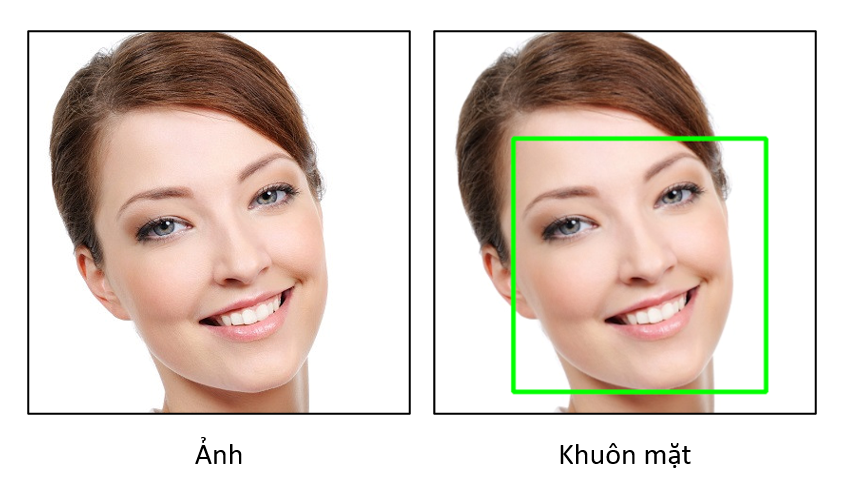
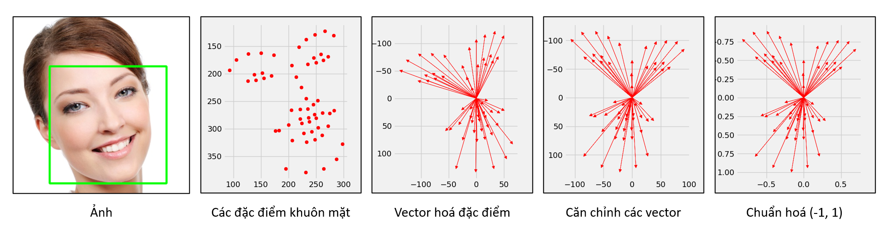
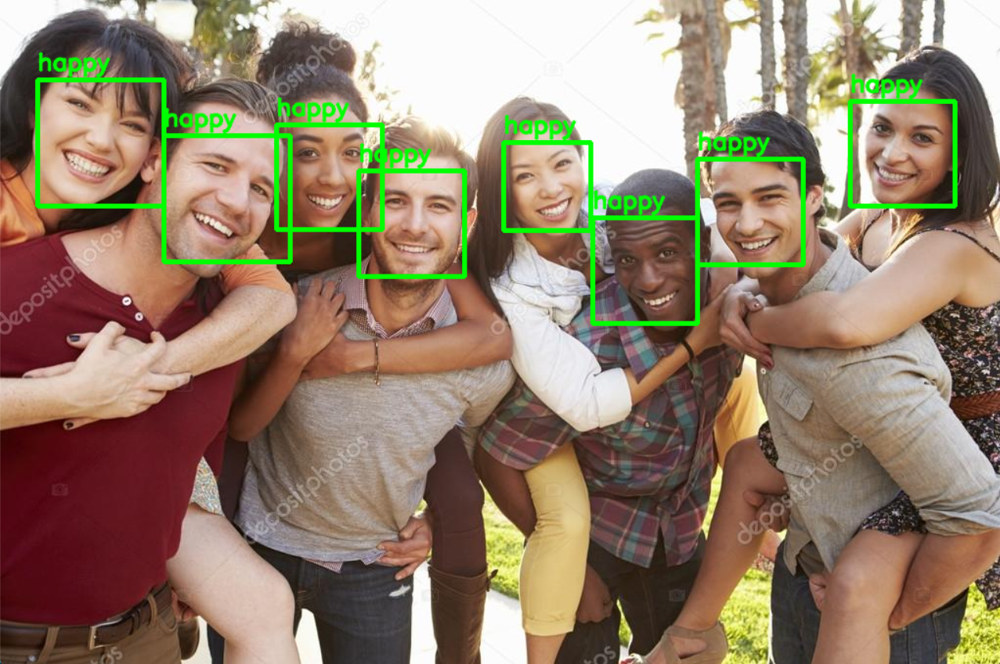

# Nhận diện biểu cảm khuôn mặt sử dụng SVM

## Hướng dẫn cài đặt môi trường

1. Cài đặt [Python 3.7.9](https://www.python.org/downloads/release/python-379/) và [Visual Studio C++](https://visualstudio.microsoft.com/vs/features/cplusplus/)

2. Tải toàn bộ code về bằng `git clone` hoặc Code -> Download ZIP rồi giải nén

3. Vào folder `facial-expression-recognition-svm` vừa có được

4. Mở Terminal:\
    Windows 11: Chuột phải -> Open in Windows Terminal\
    Windows 10: Shift + Chuột phải -> Open PowerShell window here

5. Cho phép Terminal chạy script:
    ```
    Set-ExecutionPolicy -Scope CurrentUser -ExecutionPolicy remotesigned
    ```

6. Tạo môi trường python ảo, rồi kích hoạt nó:
    ```
    python -m venv .venv
    ./.venv/Scripts/Activate.ps1
    ```

7. Cài đặt các dependency cần thiết:
    ```
    pip install -r requirements.txt
    ```

- Nếu không báo lỗi, chương trình đã sẵn sàng được sử dụng
- Trong trường hợp chúng ta muốn khôi phục lại trạng thái gốc của Terminal:

    ```
    Set-ExecutionPolicy -Scope CurrentUser -ExecutionPolicy Undefined
    deactivate
    ```

## Hướng dẫn sử dụng

Trước khi sử dụng, cần download bộ nhận dạng và dataset [tại đây](https://www.mediafire.com/file/9c9rzh7wxu6h11u/model_data.rar/file)\
Giải nén `model_data` rồi cho vào folder `facial-expression-recognition-svm`

### Huấn luyện
Chương trình có thể nhận diện được 7 loại cảm xúc khác nhau:\
**angry:angry:,
disgust:vomiting_face:,
fear:fearful:,
happy:smile:,
sad:cry:,
surprise:open_mouth:,
neutral:neutral_face:**

Tuy nhiên, càng nhiều cảm xúc mà chương trình có thể nhận dạng thì độ chính xác sẽ càng thấp, cho nên chúng ta sẽ chỉ huấn luyện nhận dạng một lượng cảm xúc nhất định thôi để tăng độ chính xác chung cho toàn bộ chương trình:

- Mở file `train_clf.py`
- Ở phần `EMOTIONS_TO_TRAIN_FOR`, thiết lập các loại cảm xúc mà bộ phân lớp sẽ nhận dạng, mặc định là `["angry", "happy", "sad", "surprise"]`
- Chọn trong danh sách các cảm xúc sau: `angry, disgust, fear, happy, sad, surprise, neutral`
- Bắt đầu quá trình huấn luyện:

    ```
    python train_clf.py
    ```
- Nếu chọn càng nhiều cảm xúc để huấn luyện thì thời gian huấn luyện sẽ càng lâu

### Chạy nhận dạng
- Chạy nhận dạng sử dụng camera:

    ```
    python predict_camera.py
    ```
- Chạy nhận dạng từ file ảnh:
    - Mở file `predict_image.py`
    - Thiết lập `run_image("<Đường dẫn tới ảnh>")`
    - Chạy:
    
        ```
        python predict_image.py
        ```
- Chạy nhận dạng từ file video:
    - Mở file `predict_video.py`
    - Thiết lập `run_video("<Đường dẫn tới video>")`
    - Chạy:
    
        ```
        python predict_video.py
        ```

- Để thiết lập mức độ chi tiết hiển thị các đặc trưng khuôn mặt, đặt `SHOW_FACE_DETAIL_LV = <0, 1, hoặc 2>` trong file `run_clf.py`

## Cơ chế hoạt động
Trong phần này mình sẽ giải thích cách xây dựng bộ phân lớp SVM để giải quyết bài toán nhận diện biểu cảm khuôn mặt này.

### Cấu trúc thành phần các file
- `expression_clf.py` là file chứa các biến và hàm cần thiết cho việc xây dựng và sử dụng bộ phân lớp, các tham số quan trọng là:
    - `LANDMARK_PREDICTOR_FILE`: File nhận dạng dlib đã được huấn luyện sẵn để nhận dạng đường bao các đặc điểm khuôn mặt
    - `DATASET`: File có chứa hơn 35,000 bức ảnh các cảm xúc khác nhau, bộ phân lớp sẽ được huấn luyện dựa trên dữ liệu ban đầu này
    - `CLF_FILE`: Đường dẫn lưu bộ phân lớp sau khi được huấn luyện xong

- `train_clf.py` là file chứa các biến và hàm cần thiết cho việc huấn luyện bộ phân lớp, các tham số quan trọng là:
    - `EMOTIONS_TO_TRAIN_FOR`: Các loại biểu cảm khuôn mặt mà ta muốn huấn luyện bộ phân lớp

- `run_clf.py` là file chứa các biến và hàm cần thiết cho việc nhận dạng cảm xúc trên ảnh, các tham số quan trọng là:
    - `SHOW_FACE_DETAIL_LV`: Mức độ chi tiết hiển thị các đặc trưng khuôn mặt

- `predict_camera.py`, `predict_image.py`, `predict_video.py` là file chạy bộ phân lớp sử dụng các phương thức dữ liệu đầu vào lần lượt là từ camera, từ file ảnh, từ file video.

### Xây dựng bộ phân lớp SVM
Đầu tiên ta sử dụng phương thức có sẵn trong thư viện dlib `get_frontal_face_detector()` để phát hiện các khuôn mặt có trong ảnh:



Tiếp theo truyền các khuôn mặt phát hiện được vào bộ nhận dạng đường bao đặc điểm khuôn mặt `shape_predictor_68_face_landmarks.dat`, file này là bộ nhận dạng dlib đã được huấn luyện sẵn để xác định các đặc trưng của khuôn mặt trên ảnh, được biểu diễn bằng 68 điểm:


Trong số 68 điểm này, ta bỏ qua các điểm 0->5, 11->16 do các điểm này không mang nhiều thông tin cảm xúc mà ta cần tìm, giúp tiết kiệm tài nguyên cho các quá trình kế tiếp.\
Kết quả nhận được được đưa lần lượt qua các lớp tiền xử lý:



- Khuôn mặt ban đầu đưa vào `shape_predictor_68_face_landmarks.dat` nhận lại được 56 điểm (68 điểm - 12 điểm không quan trọng) biểu diễn các đặc điểm: Mắt, Lông mày, Mũi, Miệng, Cằm
- Từ 56 điểm này, lấy điểm giữa mũi làm tâm (0, 0), vẽ 55 vector tới các điểm khác, vector hoá đẩy khuôn mặt về tâm trục toạ độ xOy, mục đích giúp bộ phân lớp có thể phân biệt các khuôn mặt ở bất kỳ vị trí nào trong ảnh
- Lấy cột mũi làm chuẩn, căn chỉnh (quay) tất cả các vector sao cho trục x, y của khuôn mặt vuông góc với trục x, y của mặt phẳng hình ảnh, khử độ nghiêng của ảnh, giúp cân bằng khuôn mặt trong trường hợp khuôn mặt hơi nghiêng so với camera
- Chuẩn hoá các vector về khoảng giá trị (-1, 1), việc này giúp bộ phân lớp có thể phân biệt các khuôn mặt ở bất kỳ kích cỡ nào

Kết quả cuối cùng được đưa vào bộ phân lớp SVM để huấn luyện, tuỳ vào số lượng các cảm xúc cần nhận dạng và kích thước bộ dữ liệu đầu vào mà thời gian huấn luyện sẽ khác nhau

## Sử dụng bộ phân lớp SVM để nhận dạng dữ liệu mới

- Nhận dữ liệu đầu vào từ nguồn (camera/ảnh/video)
- Đưa dữ liệu nhận được qua quá trình tiền xử lý tương tự như quá trình chuẩn bị dữ liệu huấn luyện đã được mô tả ở trên: **Phát hiện mặt -> Lấy đặc điểm -> Vector hoá -> Căn chỉnh -> Chuẩn hoá**
- Yêu cầu bộ phân lớp SVM nhận dạng dữ liệu đã qua xử lý

Kết quả nhận được là một trong số các string kết quả: `angry, disgust, fear, happy, sad, surprise, neutral`



## (▀̿Ĺ̯▀̿ ̿) Tác giả
#### *Nguyễn Thế Vinh - CNT59ĐH - Đại học Hàng Hải Việt Nam*
